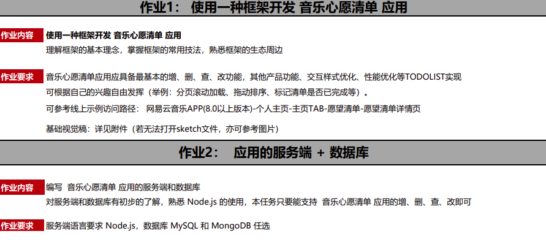
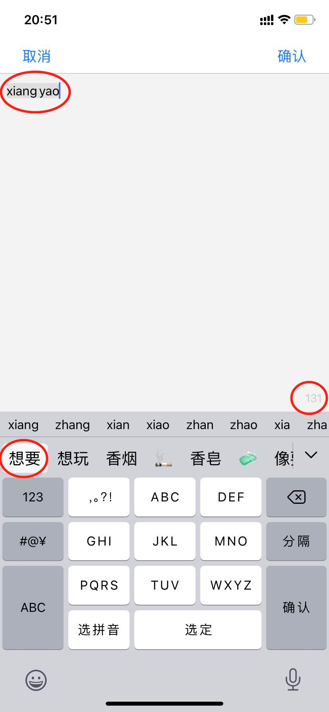

# 愿望清单

## 项目需求

## 实现情况总览

### 后端

1. 基于 koa2 及其周边生态搭建符合 restful api 规范的服务器
2. 前期使用基于内存的数据库实现功能的原型设计，后期通过 sequelize + postgres + docker 替换数据库实现，满足项目需求的增删改查
3. 在客态愿望清单的实现上，理想状态下应该引入用户这个实体，一方面能够强化关系型数据库的应用，另一方面会引入登录认证等逻辑，如果展开的话会需要较多时间开发，短期内暂时不考虑深入

### 前端

1. 由于之前已经有使用 react + redux + axios 开发 spa 应用的项目经验，本次主要尝试移动端框架的开发
2. 基于 React Native 实现愿望清单 UI 界面的开发。由于没有使用第三方组件库，对 WishList 页面的实现相对简陋，通过点击进入更改界面，通过长按触发删除交互（Alert 弹窗）
3. 基于 React Navigation 库实现类似于 Web 端的路由跳转，期间发现客户端开发与 Web 开发在路由导航方面的显著区别（坑），收获颇丰
4. 本项目的状态管理逻辑并不复杂，直接使用的 React Hooks

### 整体

1. 整体采用基于 pnpm 的 monorepo 结构，在 apps 文件夹下进行前后端应用的开发，在 libs 文件夹下进行应用共享的逻辑库开发。但是这个项目不大，显得 libs 没有太大必要。理想情况下，contract 包应该包含更多的 dto 模型定义，以及实体操作的 api 接口，更关键的是想要包含基于 Json Schema 的数据校验逻辑，奈何时间不充裕，短期内没法完善
2. 对团队规范类的开发库的学习和应用（husky，commitlint，prettier，eslint，jest，typescript，dotenv）
3. 初步了解了 pnpm 与 React Native 相性不合的原因与解决方案（方案有待改进），后期会继续深入挖掘

## 已知 bug

1. 编辑愿望（WishEdit)页面，ios 弹出键盘后在打字的内容的长度与预期不一致。如下图，在还没有完成输入的情况下，理想情况是字数为 0，至少应该是 2，但是实际上是输入的英文字符的个数。估计是 ios 的机制问题，可能通过合理的参数设置可以解决
   
